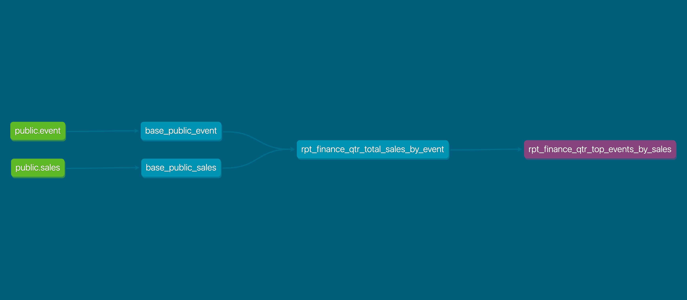
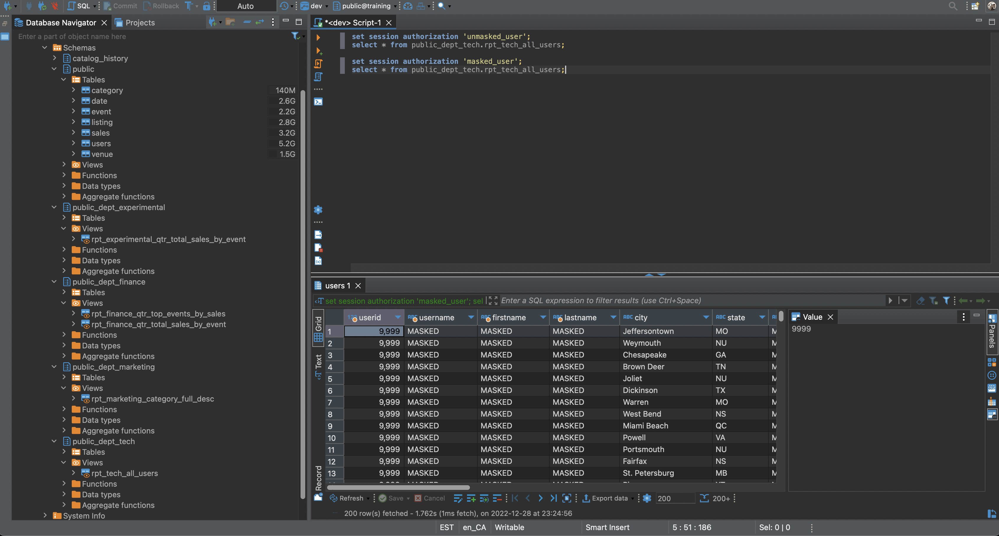

# Building an ELT Pipeline with dbt and Amazon Redshift

## Business Problem

A fictional company 'Recohut' is looking to leverage dbt on their existing data warehouse in Amazon Redshift. They need your help in establishing the dbt models and pipelines in their warehouse.

## Solution Architecture

In this project, you will:

1. Install dbt CLI
2. Use dbt dbt-labs/codegen package and Python script to automate creation of a base layer
3. Use dbt models to maintain data transformations with referencing capabilities
4. Use dbt macros to maintain common logic as functions and to administer user creation and grants
5. Use dbt hooks to automate continuous execution of grants
6. Use dbt seeds to manage manual files
7. Use dbt docs to generate documentation with visualization
8. Use dbt experimental package explore materialization of materialize views

## Pre-requisites

### Tools

You should have basic understanding of the following tools:

1. Amazon Redshift Serverless
2. dbt (data build tool)
3. Python
4. SQL
5. AWS Secret Manager

### Concepts

You should have basic understanding of the following concepts:

1. ETL Pipeline
2. Data Warehouse
3. Data Lineage

## Lab 1: Amazon Redshift Serverless

In this lab, we are going to:

1. Create Amazon Redshift Serverless Cluster on AWS
2. Connect to the Cluster from our local computer using Python
3. Use AWS Secret Manager to store and retrieve our Warehouse credentials

## Lab 2: Data Ingestion

In this lab, we are going to ingest the TICKIT dataset into the Redshift warehouse

## Lab 3: Setup dbt

In this lab, we will install dbt in our system. We will then setup the dbt project.

## Lab 4: Setup base layer

In this lab, you will setup a base layer for your models to reference. What is a base layer and what are models? Models are SQL Select statements that represents your data transformation logic including usage of case statements and joins. Base layer falls under the category of models and represents existing objects (tables and views) in your Amazon Redshift cluster.

In addition, depending on the nature of your dbt project, a base layer can be made up of different objects. For instance, a data engineer's base layer likely relates to tables containing raw data while a data analyst's base layer likely relates to tables containing cleaned data.

## Lab 5: Create models

To explore dbt's ability for objects to be referenced by other objects, in this lab, you will simulate a Finance deparment that maintains two models where the second model references the first model. To reference means to reuse and not have to duplicate code.

- Model 1 - Quarterly Total Sales By Event
- Model 2 - Quarterly Top Events By Sales (references Model 1 to rank and filter for top 3 events by sales for each quarter)

## Lab 6: Create macros

In this lab, you will use macros to create a piece of reusable data transformation logic and also to manage users and grants. Macros are a great way in dbt to create reusable pieces of SQL codes like a function in Python.

## Lab 7: Data Masking

In this lab, you will simulate a Technology department with one model that contains data masking logic.

## Lab 8: Access Control Management with dbt macros

Macros can be used to send queries to Amazon Redshift. In this lab, you will use macros to manage users and grants. Similar to the Python script earlier, you can modify the macros created in this lab to better suit your needs beyond the scope of this workshop. For example, you might want to include a new macro to manage Role-based access control (RBAC) in Amazon Redshift.

## Lab 9: dbt hooks

As models are added or updated, you will constantly need to grant access to new views and regrant access to existing views. Regranting access to an existing view is required as dbt updates by dropping existing view and creating a new view.

This introduces the operational challenge of you having to remember to run macro macro_manage_users_grants. However the process of running macro macro_manage_users_grants can be automated by hooks in dbt.

## Lab 10: Create seeds

Seeds are a convenient way in dbt for you to manage manual files. A common use case for manual files is to introduce data mappings. Manual files allows data mappings to be easily maintained and reused as compared to the usage of case statements in SQL which requires code changes when data mappings are changed.

In this Lab, you will simulate a Marketing department that maintains a custom data mapping csv that a model uses.

## Lab 11: Create documentations

The ability for objects to reference other objects improves code reusability but can result in widespread negative impact when an erroneous change is introduced to an object that is referenced by a large number of objects. dbt provides you with an interface to visualize all models and its dependencies on other models which is useful for impact analysis.

## Lab 12: Materialized View

Materialized view stores precomputed results to reduce processing time for complex queries involving multi-table joins and aggregations.

In this Lab, you will simulate an Experimental department that is exploring a dbt experimental feature.

## Project outputs

### Docs

### Dag

### Database

